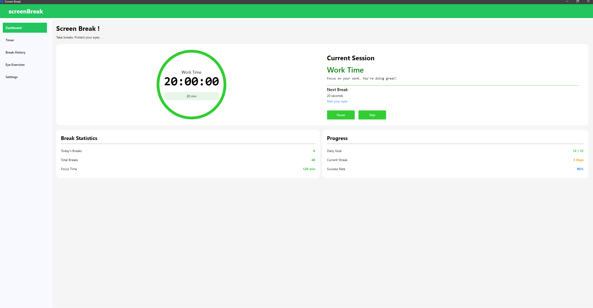

<div align="center">

# screenBreak

**A cross-platform desktop app to remind you to take breaks and protect your eyes.**  
Built with **C#**, **Avalonia UI**, and **MVVM** architecture.


> 🧠 *"Take breaks. Protect your eyes."* — Built for developers and anyone spending long hours in front of a screen.

</div>

---

## 📸 Screenshot

> Dashboard — Work timer, session info, break statistics, and progress tracking.




## 🚀 Getting Started

### Prerequisites

- [.NET 8 SDK](https://dotnet.microsoft.com/download)

### Clone & Run

```bash
git clone https://github.com/amritsyangtan-sudo/Screen-Break.git
cd Screen-Break
dotnet run
```

### Build

```bash
dotnet build
```

### Publish (Windows self-contained)

```bash
dotnet publish -c Release -r win-x64 --self-contained
```

---